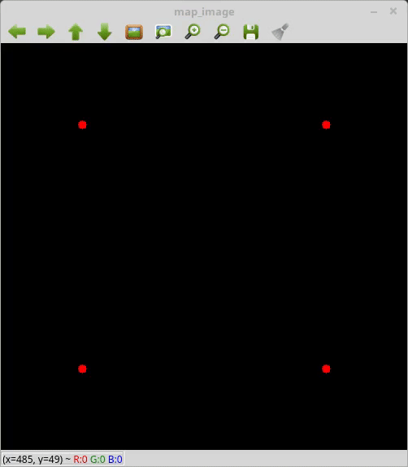
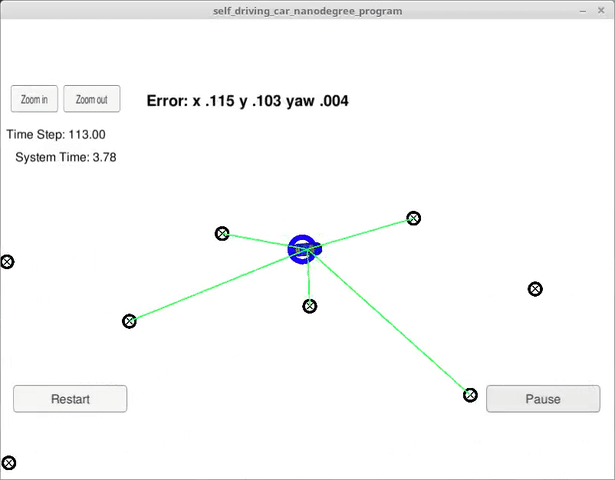

# Particle Filter Demo

## Notes:

#### 1.The slides is available [**here**](http://fs.focusky.com.cn/bxzz/bgzq/index.html).

#### 2.Before the course, I recommend all of you refer [**this**](https://www.zhihu.com/question/25371476). It will give you a whole picture of [Particle Filter](https://en.wikipedia.org/wiki/Particle_filter).

**Authors:** Xinliang Zhong. (xinliangzhong@foxmail.com)

**16 Jan 2018**: A roughly implementation of particle filter is done.

**17 Jan 2018**: The first version of reconstruction code acoording to the [Google Python Style Guide](https://google.github.io/styleguide/pyguide.html) is available.(just partical of the code)

**17 Jan 2018**: The slides is available [**here**](http://fs.focusky.com.cn/bxzz/bgzq/index.html).

## 1.Description
This project is a demo for **Particle Filter**.

+ The <font color=red>**red point**</font>: Landmarks.

+ The <font color=blue>**blue point**</font>: Robot pose.

+ The <font color=green>**green point**</font>: Particle.


Below is the result.



The final result


### Another Demo realized by C++. Find source code [here](https://github.com/TurtleZhong/Udacity_SelfDrivingCar_2SensorFusion_Project2_ParticalFilter).
The GIF result:




## 2.Prerequisites
I have tested the library in Ubuntu 16.04 (Python 2.7), but it should be easy to compile in other platforms.

#### 1.[numpy](http://www.numpy.org/)
#### 2.[opencv3](https://opencv.org/)

## 3.How to run
open the terminal in the source code folder. and run
```Bash
chmod +x particle_filter_demo.py
./particle_filter_demo.p
```

## 4.Algorithm
Please refer [this](https://en.wikipedia.org/wiki/Particle_filter)


## 5.Have fun with the code!


